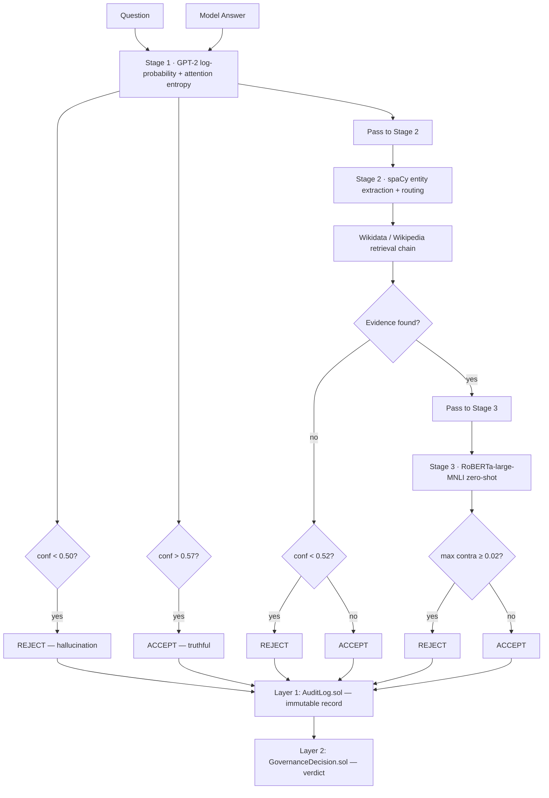
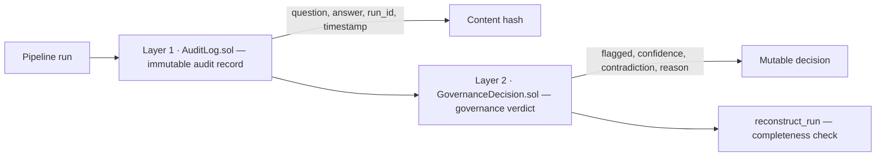

# Bio-Inspired Cascaded Hallucination Suppression

Post-hoc hallucination detection for large language models using a bio-inspired cascade architecture. The pipeline combines token-level confidence scoring, NER-guided evidence retrieval, and natural language inference contradiction detection, with optional two-layer blockchain audit governance.

**Authors:** Sharann Manojkumar, Dhriti Vaz  
**Institution:** Summer Research Internship Program (SRIP), June 2026  
**Paper:** [`reports/paper.tex`](reports/paper.tex) · Draft: [`reports/paper_draft.md`](reports/paper_draft.md)

## Overview

Large language models frequently produce confident but factually incorrect statements. This project implements a staged detection pipeline modeled on the vertebrate immune system's escalation from fast innate responses to slow adaptive responses. Most queries are resolved at early stages; expensive NLI computation is reserved for genuinely uncertain cases.

The system is evaluated on [TruthfulQA](https://github.com/sylinrl/TruthfulQA) using LLaMA-2-7B generations, with `gpt-oss-120b` as the hallucination judge. A two-layer Ethereum-compatible smart contract stack records every pipeline decision for tamper-evident audit and governance.

## Key Results

Evaluation on 200 TruthfulQA `main` split samples (LLaMA-2-7B, 30.5% baseline hallucination rate):

| Metric | Flat pipeline (C4) | Cascade pipeline |
|--------|-------------------:|-----------------:|
| Detection rate (DR) | 62.3% | 62.3% |
| False positive rate (FPR) | 68.3% | 67.6% |
| Precision | 28.6% | 28.8% |
| F1 | 39.2% | 39.4% |
| Mean latency | 3822 ms | 1916 ms |
| Speedup | — | **1.99×** |

Additional findings:

| Result | Value |
|--------|-------|
| Cascade early-exit coverage | 80.5% of queries avoid full NLI |
| NER routing improvement over keyword retrieval | +8.0 pp detection rate (18.0% → 26.2%) |
| Blockchain audit completeness | 100% across 200 evaluated runs |
| RAG overlap baseline FPR at comparable recall | 91.4% |

Full ablation (C0–C4) and cascade exit distributions are in [`data/week5/ablation_table.txt`](data/week5/ablation_table.txt) and [`data/week7/cascade_report.txt`](data/week7/cascade_report.txt).

## System Architecture



### Biological Mapping

| Immune stage | Pipeline component | Mechanism |
|--------------|-------------------|-----------|
| Pattern recognition (innate) | Confidence scorer | GPT-2 token log-probability + attention entropy |
| Antigen presentation | NER router | spaCy entity extraction → verification strategy |
| Lymphocyte activation | Evidence retrieval | Wikidata entity lookup → Wikipedia fallback |
| Effector response (adaptive) | Contradiction detector | RoBERTa-large-MNLI zero-shot classification |
| Immunological memory | Blockchain audit | Two-layer smart contract governance |

### Pipeline Modules

| Module | Path | Role |
|--------|------|------|
| Confidence scorer | `src/pipeline/confidence_scorer.py` | Fast innate gate using GPT-2 (CPU, ~210 ms) |
| NER router | `src/pipeline/ner_router.py` | Maps entity types to retrieval strategies |
| Evidence retrieval | `src/pipeline/evidence_retrieval.py` | Wikidata → Wikipedia fallback chain |
| Contradiction detector | `src/pipeline/contradiction_detector.py` | RoBERTa-large-MNLI NLI classification |
| Audit writer | `src/blockchain/audit_writer.py` | Deploys contracts, writes and reconstructs audit records |

### NER Routing Strategies

| Entity types | Strategy | Knowledge source |
|--------------|----------|------------------|
| PERSON, ORG, GPE, LOC, FAC | `entity_lookup` | Wikidata entity search |
| DATE, TIME, QUANTITY, CARDINAL, MONEY | `structured_fact` | Wikidata property search |
| EVENT, WORK_OF_ART, LAW, NORP | `text_search` | Wikipedia fulltext |
| No entities detected | `keyword_search` | Wikipedia keyword fallback |

### Blockchain Architecture



Contracts live in `src/blockchain/contracts/`. The audit bridge compiles and deploys to an in-process `eth-tester` EVM for local benchmarking (~79 ms total write time per run).

## Quick Start

Run a live hallucination check on a single question–answer pair:

```bash
git clone https://github.com/Sharann-del/Bio-Inspired-AI-Hallucination-Suppression.git
cd Bio-Inspired-AI-Hallucination-Suppression

python3.11 -m venv .venv
source .venv/bin/activate
pip install -r requirements.txt
python -m spacy download en_core_web_sm

python demo_api.py \
  "Who wrote Hamlet?" \
  "Shakespeare wrote Hamlet in 1603."
```

Expected output: stage-by-stage cascade log, final verdict (`OK` or `HALLUCINATION`), and blockchain audit transaction receipts.

**Note:** First run downloads GPT-2 and RoBERTa-large-MNLI model weights (~1.5 GB). Subsequent runs use cached weights. Stage 3 (NLI) runs on CPU to avoid Apple Silicon MPS memory issues.

## Installation

### Requirements

| Component | Version |
|-----------|---------|
| Python | 3.11.9 (see `.python-version`) |
| spaCy model | `en_core_web_sm` |
| PyTorch | CPU recommended for local demo |
| Solidity compiler | 0.8.28 (installed automatically via `py-solc-x`) |

### Setup

```bash
python3.11 -m venv .venv
source .venv/bin/activate        # Windows: .venv\Scripts\activate
pip install -r requirements.txt
python -m spacy download en_core_web_sm
export PYTHONPATH=src:$PYTHONPATH
```

### Environment Variables

Create a `.env` file in the project root (already gitignored). Required only for judge-based evaluation notebooks (Week 3), not for `demo_api.py`:

```env
OPENROUTER_API_KEY=your_key_here
```

Used by `notebooks/week3_main_eval.py`, `week3_judge_agreement.py`, and `week3_precheck.py` to call `openai/gpt-oss-120b` via OpenRouter.

## Usage

### Live Demo (`demo_api.py`)

```bash
python demo_api.py "<question>" "<answer>"
```

The demo runs the full cascade with Week 7 production thresholds:

| Parameter | Value | Effect |
|-----------|------:|--------|
| `CONF_EARLY_REJECT` | 0.500 | Stage 1 immediate reject |
| `CONF_EARLY_ACCEPT` | 0.570 | Stage 1 immediate accept |
| `CONF_THRESHOLD` | 0.520 | Stage 2 no-evidence reject gate |
| `CONTRA_THRESHOLD` | 0.020 | Stage 3 NLI contradiction gate |
| `MAX_CLAIMS` | 4 | Maximum verifiable claims per answer |

### Programmatic API

```python
import sys
from pathlib import Path
sys.path.insert(0, str(Path("src")))

from pipeline.confidence_scorer import score
from pipeline.ner_router import route
from pipeline.evidence_retrieval import retrieve
from pipeline.contradiction_detector import detect

answer = "Shakespeare wrote Hamlet in 1603."
cs = score(answer)
rd = route(answer)
ev = retrieve(rd.primary_query or answer, strategy=rd.strategy)
nl = detect(ev.evidence, answer)
```

### Blockchain Audit

```python
from blockchain.audit_writer import AuditWriter

writer = AuditWriter.create_local()
r1 = writer.write_audit_record("run-001", "Who wrote Hamlet?", "Shakespeare.")
r2 = writer.write_governance_decision(
    "run-001",
    flagged=False,
    confidence_score=0.55,
    contradiction_score=0.0,
    verdict_reason="clean",
)
assert writer.reconstruct_run("run-001").complete
```

## Repository Structure

```
bio-hallucination-suppression/
├── demo_api.py                 # Live cascade demo + blockchain audit
├── requirements.txt
├── src/
│   ├── pipeline/
│   │   ├── confidence_scorer.py
│   │   ├── ner_router.py
│   │   ├── evidence_retrieval.py
│   │   └── contradiction_detector.py
│   └── blockchain/
│       ├── audit_writer.py
│       └── contracts/
│           ├── AuditLog.sol
│           └── GovernanceDecision.sol
├── notebooks/                  # Reproducible experiment scripts
│   ├── week2_run_all.sh        # MC2 baselines + generation
│   ├── week4_run_all.sh        # Pipeline layer tests
│   ├── week6_run_all.sh        # Blockchain + RAG baseline
│   └── week7_run_all.sh        # Cascade benchmark + threshold sweep
├── data/                       # Experiment outputs (versioned)
│   ├── week2/                  # TruthfulQA generations + MC2 baselines
│   ├── week3/                  # Judge labels + claim extraction
│   ├── week4/                  # Component tests + Wikidata diagnostic
│   ├── week5/                  # Ablation study (C0–C4)
│   ├── week6/                  # Blockchain benchmark + RAG baseline
│   └── week7/                  # Cascade benchmark + sensitivity analysis
└── reports/
    ├── paper.tex               # Full paper (LaTeX)
    └── paper_draft.md          # Markdown draft
```

## Reproducing Experiments

All scripts are intended to be run from the project root.

### Week 2: Baselines and Generation

```bash
bash notebooks/week2_run_all.sh
```

Outputs: `data/week2/baselines/` (MC2 scores), `data/week2/generations/` (LLaMA-2 and Mistral outputs).

### Week 3: Judge Evaluation

Requires `OPENROUTER_API_KEY` in `.env`.

```bash
source .venv/bin/activate
python notebooks/week3_main_eval.py
python notebooks/week3_claim_extraction.py
python notebooks/week3_judge_agreement.py
```

Outputs: `data/week3/main_eval/`, `data/week3/claims/`, `data/week3/kappa/`.

### Week 4: Pipeline Component Tests

```bash
bash notebooks/week4_run_all.sh
```

Outputs: `data/week4/tests/` (per-layer JSON results), `data/week4/wikidata_reliability_report.json`.

### Week 5: Ablation Study

```bash
source .venv/bin/activate
export PYTHONPATH=src:$PYTHONPATH
python notebooks/week5_ablation_study.py
```

Outputs: `data/week5/ablation_results.json`, `data/week5/ablation_table.txt`.

### Week 6: Blockchain and RAG Baseline

```bash
bash notebooks/week6_run_all.sh
```

Outputs: `data/week6/blockchain_benchmark_summary.txt`, `data/week6/audit_completeness_report.txt`, `data/week6/rag_baseline_report.txt`.

### Week 7: Cascade Benchmark and Threshold Sensitivity

```bash
bash notebooks/week7_run_all.sh
```

Outputs: `data/week7/cascade_report.txt`, `data/week7/threshold_sensitivity_tables.txt`.

## Evaluation Methodology

| Setting | Value |
|---------|-------|
| Benchmark | TruthfulQA `main` split (200 samples) |
| Generator | LLaMA-2-7B (`data/week2/generations/llama2/main/`) |
| Hallucination judge | `openai/gpt-oss-120b` via OpenRouter |
| Baseline hallucination rate | 30.5% (61/200 judged FALSE) |
| Detection configs | C0 (none) through C4 (full pipeline) — see ablation table |

### Ablation Configurations

| Config | Description |
|--------|-------------|
| C0 | No detection (trivial baseline) |
| C1 | Confidence only (GPT-2, threshold 0.52) |
| C2 | Keyword evidence + NLI contradiction |
| C3 | NER-routed evidence + NLI contradiction |
| C4 | Full pipeline: NER + evidence + NLI OR low confidence |

## Cascade Exit Distribution

From `data/week7/cascade_report.txt` (200 samples):

| Stage | Exit type | Count | Share | Role |
|-------|-----------|------:|------:|------|
| 1 | ACCEPT | 3 | 1.5% | High-confidence fast accept |
| 1 | REJECT | 24 | 12.0% | Low-confidence fast reject |
| 2 | NO_EVIDENCE | 134 | 67.0% | Resolved without NLI |
| 3 | REJECT | 39 | 19.5% | NLI contradiction detected |

Only 19.5% of samples reach the expensive NLI stage, yielding a 1.99× latency reduction with negligible F1 change (+0.2%).

## Data

Pre-computed experiment outputs are included under `data/` (~4 MB total) so results can be inspected without re-running full pipelines. Generation JSON for Week 2 is versioned in the repository.

To regenerate from scratch, run the Week scripts in order (2 → 7). Week 2 generation requires local LLaMA-2 and Mistral model weights via `llama-cpp-python`.

## Dependencies

Core packages (see [`requirements.txt`](requirements.txt)):

| Package | Purpose |
|---------|---------|
| `spacy` | NER and claim segmentation |
| `torch`, `transformers` | GPT-2 scorer, RoBERTa NLI |
| `requests` | Wikidata and Wikipedia APIs |
| `web3`, `py-solc-x`, `eth-tester` | Local blockchain audit layer |
| `lm-eval`, `llama-cpp-python` | Week 2 MC2 evaluation and generation |
| `openai` | OpenRouter judge API (Week 3) |
| `scikit-learn` | RAG TF-IDF baseline (Week 6) |

## Citation

If you use this code or build on these results, please cite:

```bibtex
@misc{manojkumar2026bioinspired,
  author       = {Manojkumar, Sharann and Vaz, Dhriti},
  title        = {Bio-Inspired Cascaded Hallucination Suppression in Large
                  Language Models with Blockchain Audit Governance},
  year         = {2026},
  howpublished = {Summer Research Internship Program (SRIP)},
  url          = {https://github.com/Sharann-del/Bio-Inspired-AI-Hallucination-Suppression}
}
```

## License

This project is released under the MIT License. See [`LICENSE`](LICENSE) for details.

## Acknowledgments

- [TruthfulQA](https://github.com/sylinrl/TruthfulQA) benchmark (Lin et al., 2022)
- [LLaMA-2](https://ai.meta.com/llama/) and [Mistral-7B](https://mistral.ai/) for generation
- [RoBERTa-large-MNLI](https://huggingface.co/roberta-large-mnli) for zero-shot NLI
- [spaCy](https://spacy.io/) for named entity recognition
- [Wikidata](https://www.wikidata.org/) and [Wikipedia](https://www.wikipedia.org/) for external evidence
